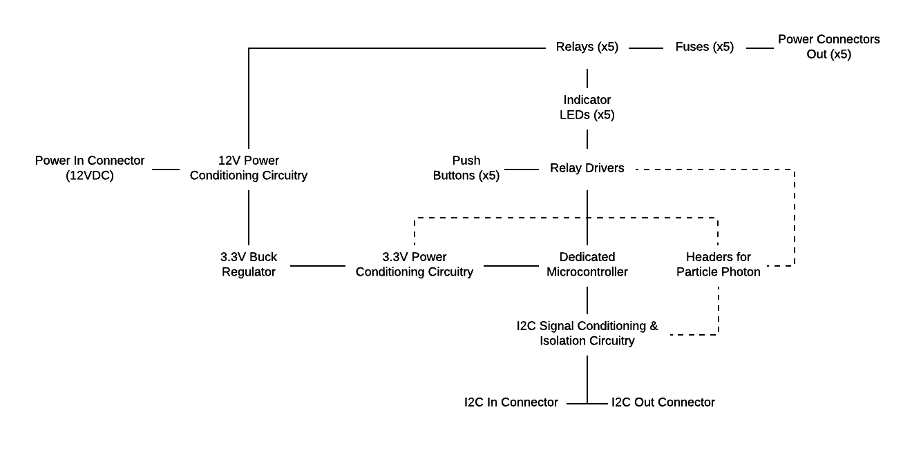
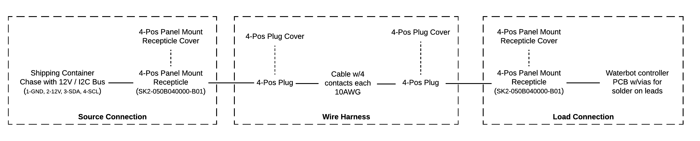

# OpenAg Waterbot Controller
Printed Circuit Board (PCB) that enables computer control for nutrient dosing in the Food Server (FS)

## Contents
- [Specification](documentation/spec.md)
- [Bill of Materials](documentation/bom.csv)

## System Block Diagram

## Connection Diagram
