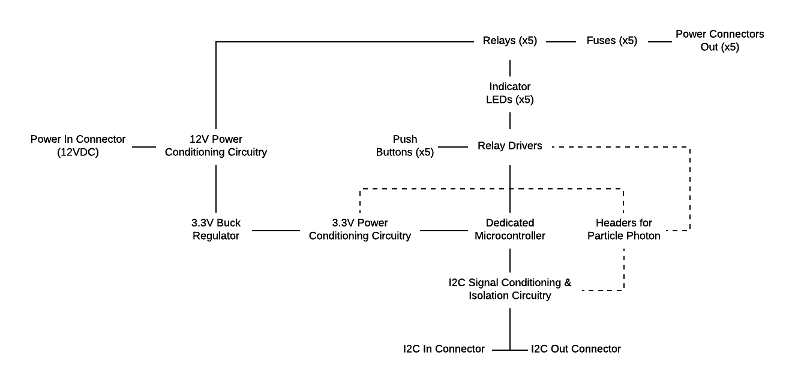

# OpenAg Water Bot Controller Specification

## Objective
The Open Agriculture Initiative at MIT's Media Lab is developing a Food Server, a shipping container sized unit outfitted with sensors and actuators for creating an automated control environment for hydroponic plant growth research.

A major component to the Food Server design is the Water Bot, a device for precisely controlling nutrient delivery to the plants. The Water Bot has five solenoid valves that must be controlled from a computer. The Water Bot Controller PCB will provide such control.

## Features
- Device will communicate via I2C with the Brain Box, the master control device built around the Beaglebone Black.
- Device will be powered from the 12VDC power lines running throughout the Food Server. 
- Device will be able to control the power to x5 12V-2A solenoids
- Device will have the option for manual control via pushbuttons that turn on/off the solenoids.
- Device will have a dedicated, low-cost onboard microcontroller that can be programmed to communicate via I2C and send high/low signals to the relay drivers to turn on/off the solenoids. 
- Device will have optional headers and zero-ohm resistor pads for connecting a Particle Photon in order to make the PCB a standalone IoT device. 
- Best practices will be followed to minimize electromagnetic interference throughout the device. 
- As the device will operate inside an environment that is subjected to high humidities and water splashing, all signal and power connectors will have an IP67 rating and the assembled PCB (PCBA) will be conformally coated.
- Device will integrate with mechanical mount on the side of each grow rack

## Block Diagram

## Supporting Documents
- Brain PCB V1 schematic & board files 
- Brain PCB V1 datasheets
- Example PSoC 4000 schematic & board files

